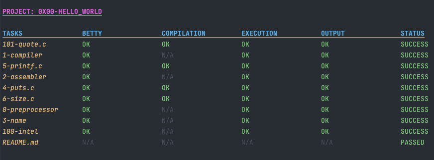

<p align="center">  

</p>

<h1 align="center">
	ALX CHECKER COMMING SOON!
</h1>

<!-- 
<p align="center">  

</p> -->

<!-- <h1 align="center">
	ALX CHECKER
</h1> -->

## About

This repository contains a checker created for the ALX Low-Level Programming course projects. The checker are designed to automate the checking process and ensure that the projects meet the requirements of the course. The checker cover various aspects of the projects, such as coding style, syntax, and expected output. The repository is a useful tool for ALX students to ensure that their projects are up to the standard required by the course.

<!-- ## Checkers
- [0x00-hello_world](./0x00-checker)
- [0x01-variables_if_else_while](./0x01-checker)
- [0x02-functions_nested_loops](./0x02-checker)
- [0x03-debugging](./0x03-checker)
- [0x04-more_functions_nested_loops](./0x04-checker) -->

---


## Pre-release First Look

<p align="center">  

</p>

>Note: N/A stands for Not Applicable and means that:
>    - The requirement is not applicable to the task.
>    - The output is random and can't be checked.

## Installation

To install the alx-checker tool, simply copy the following command and paste it into your terminal:

```shell
sudo bash -c "$(curl -fsSL https://raw.githubusercontent.com/achrafelkhnissi/alx-checker/main/install.sh)"
```

This command will download and run the [install.sh](./install.sh) script from this GitHub repository, which will install all necessary dependencies and configure the tool for use.

- `sudo` is used to install the tool in the system directory, so that it can be used by any user on the system.
  - If you do not have `sudo` installed, you can install it by running `apt-get install sudo` in your terminal.
  - Note: sudo is needed in order to install Betty, the ALX coding style checker.
  - If you already have `Betty` installed on your system you can remove the `sudo` command from the above command.
- `bash` is used to run the script.
  - The `-c` option specifies that the following argument should be treated as a command to execute.
- `curl` is used to download the script from GitHub.
  - If you do not have `curl` installed, you can install it by running `apt-get install curl` in your terminal.
  - If you don't want to install `curl` you can download the script manually and run it.
  - The `-fsSL` options are used to download the script without displaying any progress bar
    - `-f` - Fail silently (no output at all) on server errors.
    - `-s` - Silent mode. Don't show progress meter or error messages.
    - `-S` - Show error. With -s, make curl show errors when they occur.
    - `-L` - If the server reports that the requested page has moved to a different location (indicated with a Location: header and a 3XX response code), this option will make curl redo the request on the new place.

## Requirements

- Clang 5.0 and later

----

## Author

- [`@achrafelkhnissi`]() | Software Engineer Student

    > Reach out to me if you need any help or have any questions.

	<a href="mailto:achraf.elkhnissi@icloud.com">
		
	</a>
	<span> * </span>
    <a href="https://www.linkedin.com/in/achrafelkhnissi/">
        
    </a>
    <span> * </span>
    <a href="https://twitter.com/suprivada">
        
    </a>
    <span> * </span>
    <a href="https://www.linkedin.com/in/achrafelkhnissi/">
        
    </a>
    
---


## Alx Projects

#### - [alx-system_engineering-devops](https://github.com/achrafelkhnissi/alx-system_engineering-devops)
- [0x00-shell_basics](https://github.com/achrafelkhnissi/alx-system_engineering-devops/tree/main/0x00-shell_basics)
- [0x01-shell_permissions](https://github.com/achrafelkhnissi/alx-system_engineering-devops/tree/main/0x01-shell_permissions)
- [0x02-shell_redirections](https://github.com/achrafelkhnissi/alx-system_engineering-devops/tree/main/0x02-shell_redirections)
- [0x03-shell_variables_expansions](https://github.com/achrafelkhnissi/alx-system_engineering-devops/tree/main/0x03-shell_variables_expansions)
  
#### - [alx-low_level_programming](https://github.com/achrafelkhnissi/alx-low_level_programming)
- [0x00-hello_world](https://github.com/achrafelkhnissi/alx-low_level_programming/tree/main/0x00-hello_world)
- [0x01-variables_if_else_while](https://github.com/achrafelkhnissi/alx-low_level_programming/tree/main/0x01-variables_if_else_while)
- [0x02-functions_nested_loops](https://github.com/achrafelkhnissi/alx-low_level_programming/tree/main/0x02-functions_nested_loops)
- [0x03-debugging](https://github.com/achrafelkhnissi/alx-low_level_programming/tree/main/0x03-debugging)
- [0x04-more_functions_nested_loops](https://github.com/achrafelkhnissi/alx-low_level_programming)
- [0x05-pointers_arrays_strings](https://github.com/achrafelkhnissi/alx-low_level_programming/tree/main/0x05-pointers_arrays_strings)
- [0x06-pointers_arrays_strings](https://github.com/achrafelkhnissi/alx-low_level_programming/tree/main/0x06-pointers_arrays_strings)

## TODO
- [ ] While installing Betty in 1337 iMac, Find a way to install it without using sudo
- [ ] Tell the user to run the script using sudo if it fails to install Betty
- [ ] Handle multiple flags
- [x] Add update functionality to the checker
- [ ] Make the script installable with `apt-get` and `brew` (check checkinstall) - [guide](https://packaging.ubuntu.com/html/)
- [ ] Reform the code to c++11 instead of c++17
- [x] Make the output more colorful and beautiful
- [ ] Add a progress bar
- [ ] For each project add 2 directories one for `test_files` and the other for `expected_output`
- [ ] Install `libc6-dev-i386` for 32-bit compilation in 0x00 task 6
- [ ] Docker file to run the checker in a container (check [Link](https://www.ibm.com/docs/en/cloud-private/3.1.1?topic=pyci-specifying-default-docker-storage-directory-by-using-bind-mount) [Link](https://forums.docker.com/t/how-do-i-change-the-docker-image-installation-directory/1169) [Link](https://stackoverflow.com/questions/24309526/how-to-change-the-docker-image-installation-directory))
  - Try `sudo dockerd --data-root /my/docker/data`
  
- [ ] Handle special files:
	- 0x01-0/1 generates random output
    - 0x03- add any file that doesn't have a main in its name to the compiled list
      - 0x03-1 int i unused variable
    - 0x05-101 find a way test 101-keygen.c
